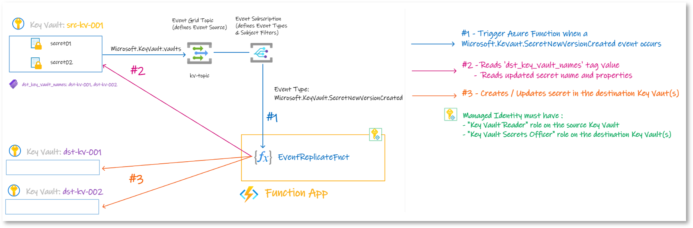

# Azure Function - Key Vault Secret Replication 

This project contains two Azure Functions that enable replication of secrets from a source Key Vault to one or more destination Key Vaults. 

The destination Key Vaults are specified in the `dst_key_vault_names` tag of the source Key Vault.

# Azure Functions

## FullReplicateFnct

This first Azure Function performs a complete replication of **all secrets** from the source Key Vault to the destination Key Vault(s). 

It copies all secrets and their properties, ensuring an identical replica in the destination Key Vault(s).

**Diagram**:

## EventReplicateFnct

This second Azure Function utilizes an event-driven approach based on Event Grid. Whenever a secret is updated in the source Key Vault, it is *almost* instantly replicated to the destination Key Vault(s). 

This function ensures **near real-time synchronization of secrets between the source and the destination Key Vault(s)**, minimizing any potential data inconsistencies.

**Diagram**:

# Getting Started

To deploy and use the Key Vault Secret Replication Functions, follow the steps below:

1. Clone the repository:
2. Install the necessary dependencies and libraries.
3. Deploy the Azure Functions to your Azure subscription.
4. Configure Azure Function Managed Identity
   1. Provide "Key Vault Reader" role on the source Key Vault
   2. Provide "Key Vault Secrets" role on the destination Key Vault(s)
5. Set up the necessary Event Grid subscription to trigger the event-driven replication function when secret updates occur in the source Key Vault.
6. Ensure the source Key Vault has the `dst_key_vault_names` tag with the names of the destination Key Vaults specified, **comma-separated**.

## Requirements

* Function App:
  * Runtime stack: Python
  * Version: 3.10
  * Hosting options and plans: Consumption (Serverless) or Functions Premium or App service plan

## Limitations

* Only `enabled` secrets on the source Key Vault can be replicated to the destination Key Vault(s).

## Parking

* If a secret is deleted on the source Key Vault, what behavior do we expect ?